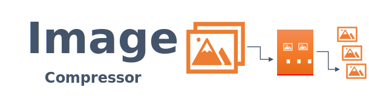

<div align="center">





[](./README-es.md)

[](https://nodejs.org/en)
 [](https://choosealicense.com/licenses/mit/) 
 


</div> 


 
**Image Compressor** is a command line tool developed on the [imagemin](https://www.npmjs.com/package/imagemin) project. Allows you to compress an image or a set of images. Supports images in the formats: `.jpg, .png, .svg, .gif y .webp.` 

Compression specifications are set using an external file.

 
## Features
- Compress GIF images
- Compress JPEG images
- Compress PNG images
- Compress SVG images
- Compress WEBP images

## Installation

1. Clone the repo
   ```sh
   git clone https://github.com/GILLMtz/image-compressor.git
   ```
2. Install NPM packages
   ```sh
   npm install
   ```

## Usage/Examples
### Run using configuration in external file

`Run `
```javascript
npm start -- -configFile=config.ic
```

`Content in config.ic`

```javascript
-inputFolder="my-spotify/media" 
-outputFolder="compressed"
-generateWebpFiles="false" jjbl jkhhj
-log="false"
```


## Documentation


 
| Param             |  Description                                                       |
| :-----------------|:------------------------------------------------------------------ |
| `-inputFolder`      | Path where the image or images to be compressed are located                                                  |
| `-outputFolder`     | Directory where the files produced by compression are saved |
| `-generateWebpFiles`| Indicates obtaining a file in `.webp` format as a result of the compression process for the `.png and .jpg` formats |
| `-log `             | Indicates whether the logs should be displayed during the compression process.|

## Technologies


[](https://nodejs.org/)

## License

This project is licensed under the MIT License.
